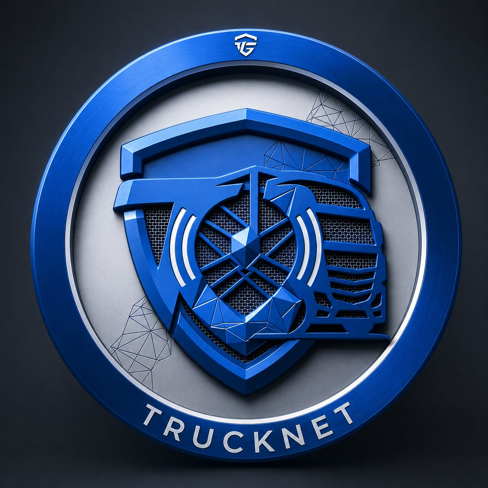
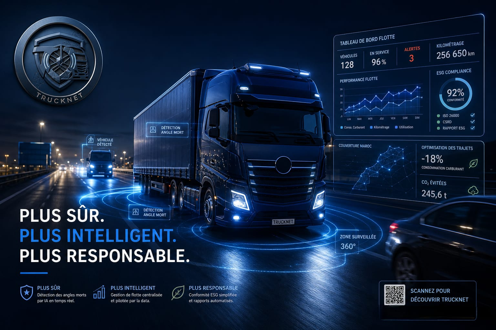

<p align="center">
  
</p>

<h1 align="center">TruckNet</h1>
<p align="center"><strong>Intelligence au cœur du transport routier marocain</strong></p>

<p align="center">
  
</p>

---

TruckNet est une solution B2B SaaS de gestion de flottes conçue pour les transporteurs routiers marocains (5–80 camions). Elle combine IoT embarqué, IA temps réel et analytics ESG pour adresser trois enjeux critiques : la sécurité des angles morts, la conformité ISO 26000 / CSRD, et la traçabilité de la chaîne du froid.

---

## Démonstration

https://github.com/akmeonuzraa/LP_TruckNet/blob/main/public/assets/demo.mp4

> Démo de la landing page TruckNet — détection d'angles morts, tableau de bord flotte, conformité ESG.

---

## Modules

### SafeDetect
Détection d'angles morts et d'obstacles en temps réel par IA embarquée.

| Spécification | Valeur |
|---|---|
| Latence détection | < 50 ms |
| Couverture | 360° |
| Connectivité | 4G / WiFi |
| Capteur radar | HLK-LD2450 24 GHz |
| Vision | Arducam USB 180° + YOLOv8 |

---

### TruckNet Core / CSR-ESG
Plateforme centrale de gestion de flotte avec reporting ESG automatisé.

| Spécification | Valeur |
|---|---|
| Référentiels | ISO 26000, CSRD |
| Rafraîchissement dashboard | 1 s |
| Historique | 24 mois |
| Rapports | Générés automatiquement (LLM agents) |

---

### Supply Chain (ColdChain)
Monitoring IoT de la chaîne du froid avec alertes prédictives.

| Spécification | Valeur |
|---|---|
| Précision température | ±0.1 °C |
| Capteurs | DHT11, MPU6050 |
| Alertes | < 5 s |
| Stockage série temporelle | InfluxDB |

---

## Stack technique

**Hardware**
- ESP32 WROOM-32
- Raspberry Pi 4 (4 GB)
- HLK-LD2450 (radar 24 GHz)
- Arducam USB 180°
- DHT11 / MPU6050

**Software**
- Frontend : React / Next.js / Tailwind CSS
- Backend : FastAPI (Python)
- Streaming : Apache Kafka
- Bases de données : PostgreSQL, InfluxDB
- Cloud : AWS eu-west-1
- IA : YOLOv8, LLM agents

---

## Coût matériel par véhicule

| Poste | Montant (MAD) |
|---|---|
| Kit IoT embarqué | 1 800 – 2 200 |

---

## Modèle économique

| Source | Type |
|---|---|
| Vente du kit hardware | One-time par véhicule |
| SaaS SafeDetect + Core | Abonnement mensuel par véhicule |
| Package ESG | Forfait annuel par entreprise |
| InsurTech (Wafa / AXA Maroc) | Scoring conducteur anonymisé |

---

## Déploiement géographique

Casablanca → Tanger → Fès / Marrakech → Agadir

---

## L'équipe

| Nom | Rôle |
|---|---|
| **Amoura Kenza** | Co-fondatrice |
| **Aymane Allouch** | Backend senior / Cloud |
| **Adam El-Araqy** | Fullstack |
| **Abdelmajid Chantr** | Systèmes embarqués / Capteurs |
| **Ouissal Nari** | Installation & terrain |

---

## Installation locale

```bash
pnpm install
pnpm dev
```

Ouvrir [http://localhost:3000](http://localhost:3000).

```bash
pnpm build   # production
```

---

## Licence

© 2026 TruckNet. Tous droits réservés.
